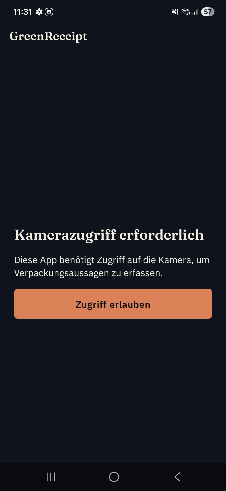
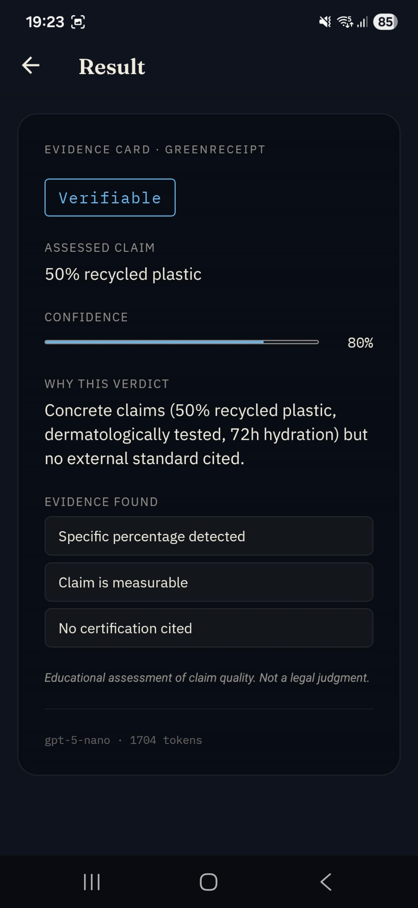

# greenreceipt

A React Native app for the German market that photographs product packaging, OCRs the text on-device, and classifies each sustainability claim into one of four evidence tiers via an OpenAI-backed Supabase Edge Function.


## Demo

| Camera permission (German UI) | Classification result |
|---|---|
|  |  |

The result screen shows a `Verifiable` verdict for a "50% recycled plastic" claim, with confidence, reasoning, evidence points, model name, and token count returned by the Edge Function. The permission screen is what a first-time user sees before the camera flow starts, and it's fully in German like the rest of the app.

## Architecture

```
Expo app (React Native, on-device OCR)
   │  photo → ML Kit text recognition → editable claim text
   ▼
Supabase Edge Function: classify  (Deno, holds OPENAI_API_KEY)
   │  rate-limit pre-check (20 scans/device/24h) against Postgres
   │  raw fetch → OpenAI Responses API, model gpt-5-nano
   │  (fallback gpt-4.1-nano via OPENAI_MODEL env, no redeploy)
   │  strict json_schema response: verdict/confidence/reasoning/evidence
   ▼
Postgres table: public.scans
   (device_id, verdict, confidence, model_used, tokens_used, created_at:
    claim text itself is never persisted)
```

The client never talks to OpenAI directly; it calls the Edge Function through the Supabase JS client (`src/services/classify.ts`), which normalizes OCR text and validates the response against a Zod schema before render. The Edge Function itself is a single Deno file with no project imports: it does its own UUID validation, rate-limit lookup, raw `fetch` to OpenAI's Responses API, and a Postgres insert, all in `supabase/functions/classify/index.ts`.

Six screens make up the whole client: Home (camera), Review (editable OCR text), Verdict (the result), and stubs for Share, History, and Settings that are reserved for later phases but not yet built out.

**Stack:** Expo SDK 54, React Native 0.81.5, React 19.1.0, TypeScript 5.9 in strict mode, `@supabase/supabase-js`, `zod` for runtime schema validation on both client and server, `@react-navigation/native-stack` for the navigator, and `@react-native-ml-kit/text-recognition` for OCR. The full dependency list is intentionally short: the project's own `CLAUDE.md` locks it to 14 packages and requires sign-off before adding a 15th.

Rate limiting is enforced server-side, not client-side: the Edge Function runs a `SELECT` against `scans` for the calling `device_id` before it ever calls OpenAI, and returns HTTP 429 once the daily cap is hit. That keeps the cap effective even against a modified or rebuilt client.

## Quickstart

```bash
npm install
cp .env.example .env.local   # fill EXPO_PUBLIC_SUPABASE_URL / EXPO_PUBLIC_SUPABASE_ANON_KEY
npm start                    # expo start; scan the QR with Expo Go / a dev client
supabase db push             # apply supabase/migrations/20260514_init.sql
supabase functions deploy classify   # requires OPENAI_API_KEY etc. set via `supabase secrets set`
```

`npm run android` and `npm run ios` are also available as thin wrappers around `expo start` for platform-specific dev clients (see `package.json`). There's no build or lint script defined yet. `npx tsc --noEmit` is the closest thing to a CI gate, run manually per the project's own phase checklist.

The client only needs two environment variables, both public by design (`.env.example`):

| Variable | Purpose |
|---|---|
| `EXPO_PUBLIC_SUPABASE_URL` | Supabase project URL, used by the client to reach the Edge Function |
| `EXPO_PUBLIC_SUPABASE_ANON_KEY` | Supabase anon key; RLS on `scans` denies it read/write, so it can't be used to bypass the rate limit or read other scans |

Everything sensitive (`OPENAI_API_KEY`, `OPENAI_MODEL`, `SUPABASE_SERVICE_ROLE_KEY`) is set separately as a Supabase Function secret with `supabase secrets set`, never in a client-facing `.env` file.

## Results

| Metric | Value |
|---|---|
| Edge Functions | 1 (`classify`) |
| Edge Function size | 336 lines, 2 files (Deno/TypeScript) |
| Migrations / tables | 1 / 1 (`public.scans`) |
| Row-level security | enabled, zero anon policies (deny-all; service role only) |
| Screens | 6 (Home, Review, Verdict, Share, History, Settings), locked, no additions |
| `src/` size | 883 lines, 17 files |
| Claim categories | 4 (`Vague`, `Verifiable`, `Unsupported`, `Substantiated`) |
| UI copy | 59 lines, all in `src/locales/de.ts` |
| Commits on `main` | 33, one atomic task each |
| Automated tests | 0 |
| Published eval/accuracy numbers | 0 |

The last two rows aren't a gap this README is glossing over: see Limitations for what that means in practice.

## Design decisions

- **OpenAI key lives only in the Edge Function, not the client.**
  `src/` is grepped for `OPENAI_API_KEY|sk-` as part of the project's own verification step (see `CLAUDE.md`), and `supabase/functions/classify/index.ts` reads the key from `Deno.env`. The React Native bundle never sees it, so a decompiled APK can't leak it.

- **OCR happens on-device, not through an uploaded image.**
  `@react-native-ml-kit/text-recognition` extracts text on the phone; `src/services/ocrNormalize.ts` collapses whitespace and strips duplicate lines before the text is sent anywhere. No packaging photo leaves the device: only the extracted text does, and the Edge Function explicitly rejects any payload shaped like an image (`grep image_url` returns nothing by design).

- **The classification prompt is fixed and few-shot, not open-ended.**
  `supabase/functions/classify/index.ts` hardcodes a 4-category rubric (Vague / Verifiable / Unsupported / Substantiated) with a conservative-bias rule ("when uncertain, downgrade") and 10 few-shot examples in German and English. It also carries an explicit forbidden-wording list (no "greenwashing", "Betrug", "illegal", "fraud", etc.), so the model can describe what a claim lacks without accusing a brand of wrongdoing.

- **Claim text is never persisted, only the verdict and token count.**
  `supabase/migrations/20260514_init.sql` defines `scans` with no `claim_text` column at all: that's a privacy choice enforced at the schema level, not something application code has to remember to respect.

- **React Native/Expo instead of a web app**, because the core interaction is the phone camera plus on-device OCR. `app.json` requests only `CAMERA` and `RECORD_AUDIO` permissions, and the Edge Function does no server-side image handling, so there's nowhere for a browser-based flow to plug in without re-adding an upload step the architecture is designed to avoid.

- **Rate limiting is defense-in-depth, not single-layer.** The Edge Function's pre-check against `scans` is the primary control, and the deny-all row-level security policy on the table is a second, independent barrier: even if the pre-check logic had a bug, the anon key still can't read or write the table directly.

## Limitations

- **No automated test suite.** No Jest config, no `__tests__` directories, and no `test` script in `package.json`. Verification is manual and command-based, tracked in `.specs/phases/01-core-loop/VERIFY.md`, not enforced by CI.

- **German-only UI.** All 59 lines of copy live in `src/locales/de.ts`; there's no localization layer or second language for other markets yet.

- **Per-scan cost and latency scale with OpenAI usage.** The Edge Function calls `gpt-5-nano` by default, with `gpt-4.1-nano` available as a fallback via the `OPENAI_MODEL` env var. Neither has published accuracy numbers in this repo, and there's no eval harness comparing model choices against labeled claims.

- **OCR quality depends on lighting and packaging condition.** There's no OCR-quality fallback beyond the prompt's own instruction to return `Vague` with low confidence on empty or garbled input.

- **Not published to the App Store or Play Store.** `eas.json` and `app.json` are configured for Expo builds under bundle ID `com.sdamianiw.greenreceipt`, but there is no store listing or release build referenced in the repo.

- **Most of the screenshots directory is debug material, not product photography.** Six of the eight files are blank-screen bug reports or home-screen icon grids; the Demo section above uses the two that actually show app UI.

- **Single-region, single-provider dependency.** The whole classification path goes through one OpenAI model family and one Supabase project; there's no multi-provider fallback if OpenAI has an outage, only the `gpt-5-nano` → `gpt-4.1-nano` swap within OpenAI itself.

## License

MIT
